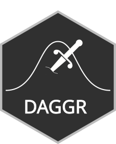
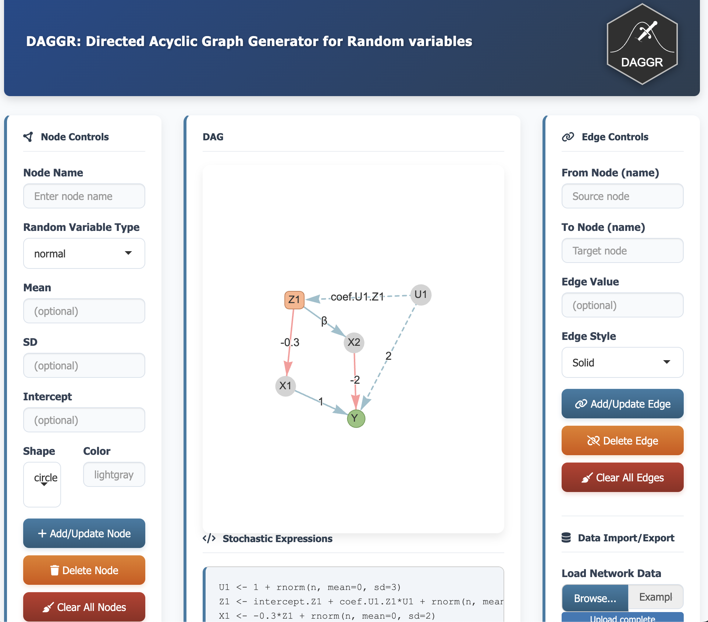

  
# DAGGR: Directed Acyclic Graph Generator for Random Variables  
  


## Overview

**DAGGR** is an interactive R Shiny application designed for visually building and defining **Directed Acyclic Graphs (DAGs)** composed of statistical random variables. It provides an intuitive point-and-click interface to construct complex causal or statistical models, and then automatically generates the corresponding R code to simulate data from your defined model.


## Example DAG in DAGGR

For a simple DAG that shows different features of the app start the app (webbased or locally) and
load the file `./examples/Example_DAGGR_Data.rds`. 



## Live Demo / Installation

You can run DAGGR directly in your browser or locally.

### Option 1: Run Online (No Installation Required)
A live version of the app is hosted on ShinyApps.io:  
  **[→ Launch the DAGGR Web App ←](https://moritz-hanke.github.io/DAGGR/)**  
  

### Option 2: Run Locally from R/RStudio
  
To run DAGGR on your own machine, ensure you have R installed and then run the following code in your console:
  
```r
# Install required packages if you don't have them
if(!require("shiny")) install.packages("shiny")
if(!require("visNetwork")) install.packages("visNetwork")
if(!require("shinyjs")) install.packages("shinyjs")
if(!require("DT")) install.packages("DT")
if(!require("igraph")) install.packages("igraph")
if(!require("base64enc")) install.packages("base64enc")

# Run the app directly from GitHub using shiny::runGitHub
shiny::runGitHub("moritz-hanke/DAGGR", subdir = "/")
```

Alternatively, clone the repository and run the app.R file:

```r
# Clone the repo or download the source code, then:
setwd("path/to/DAGGR-App")
shiny::runApp()
```

## Features

* **Visual Graph Construction**: Drag-and-drop interface to build DAGs with nodes and edges.
* **Multiple Random Variable Types**: Define nodes as 
  * `normal` (with mean, SD) 
  * `binomial` (with size, probability) 
  * further distributions will be implemented
* **Automatic R Code Generation**: The app automatically writes the R code for the stochastic expressions  based on your visual graph for further data-generating process.
* **Cycle Prevention**: Built-in checks prevent the creation of cyclic graphs, ensuring they remain "Acyclic".
* **Customizable**: Control node colors, shapes, edge styles (solid/dashed), and coefficients.
* **Import & Export**: Save your network and and stoachstic espressions as an .rds file to share or load it later for further editing.


## Usage Guide

### 1. Defining Nodes (Random Variables)

* **Enter a Node Name**: Start by typing a unique name for your variable (e.g., `X`, `Treatment`, `Outcome`).
* **Select a Type**: Choose `normal` or `binomial` from the dropdown.
* **Set Parameters**:
  * For `normal`: Optionally specify a Mean and SD. If left blank, placeholders (eg, `mean.X`, `sd.X` if the node is named `X` and as `normal` defined) will be used in the code.
  * For `binomial`: Optionally specify a probability `p` and size `n`.
* **Set an Intercept**: You can add a fixed intercept term to the node's equation (optional).
* **Customize Appearance**: Choose a Shape (`circle` or `box`) and a Color (e.g., `"lightblue"`, `"#FF9999"`). Uses any valid CSS color.
* **Add the Node**: Click `"Add/Update Node"`. The node will appear in the network visualization panel.
* **Change Position**: You can position the node by dragging them in the plot. When you save your DAG (see below) this position will be saved too.

### 2. Edit existing nodes
* Simply follow the steps to create a node; if the node already exists it will be updated by the new values

### 3. Defining Edges (Dependencies)

Edges represent causal paths or dependencies between variables (`X -> Y` means `X causes Y`).

* **Specify Connection**: Type the exact names of the `From Node` (source) and `To Node` (target).
* **Set a Coefficient**: Enter a numeric value for the edge's weight (e.g., `0.5`, `-1.2`). If left blank, a placeholder (e.g. `coef.X.Y` if the edge `X -> Y` is defined) is generated.
* **Choose a Line Style**: Select Solid for a typical path or Dashed for optional or hypothetical relationships.
* **Add the Edge**: Click "Add/Update Edge". An arrow will connect the two nodes. The app will prevent you from creating cycles.

### 4. Update Edges 
* Similar to the update of nodes: if the edge for `From Node` and `To Node` is already in the graph it will be update with new values

### 5. Delete Nodes/Edges
* Type in the exact name of the node or the `From Node` and `To Node` and then click `Delete Node` / `Delete Edge`

### 6. Intrepreting the output

The middle panel provides two key outputs:

* **DAG**: The interactive visual graph. You can click and drag nodes to rearrange the layout.
* **Stochastic Expressions**: The automatically generated R code that defines how each variable is computed. This code is topologically sorted, meaning a variable's dependencies are defined before it is used.
* *igraph object**: the visNetwork is transformed to an igraph object that can be further processed.
* **Node Attributes**: A table summarizing all nodes and their properties.

Example Output Code for the stochastic experession (based on the example DAG `./examples/Example_DAGGR_Data.rds`):

``` r
U1 <- 1 + rnorm(n, mean=0, sd=3)
Z1 <- intercept.Z1 + coef.U1.Z1*U1 + rnorm(n, mean=2, sd=4)
X1 <- -0.3*Z1 + rnorm(n, mean=0, sd=2)
X2 <- β*Z1 + rbinom(n, size=1, prob=0.3)
Y <- 3 + 1*X1 + -2*X2 + 2*U1 + rnorm(n, mean=mean.Y, sd=sd.Y)
```

### 7. Saving and Loading Your Work

* To **Save**: Click `"Generate Download Link"` after building your graph. You can provide a custom filename. Click the generated link to download an `.rds` file containing all nodes, edges, and their properties.
* To **Load**: Use the "Load Network Data" button to upload a previously saved .rds file and continue working.

### 8. Generating random values based
Using the saved `.rds`obejct we can generate random values based on the saved expressions.

```{r echo=TRUE}
library(igraph)
library(visNetwork)
# load saved rds
dag_data <- readRDS("examples/Example_DAGGR_Data.rds")

# extract expressions
dag_expressions <- dag_data$expressions

# print expressions
print(dag_expressions)

# plot the generared DAG as an igraph object
plot(dag_data$igraphNetwork, 
     layout = cbind(dag_data$nodes$x, dag_data$nodes$y),
     vertex.label.color = "black",
     vertex.label.cex = 1,
     edge.arrow.size = 0.75,
     edge.arrow.width = 1,
     edge.width = 2)

# 100 observations for the random variables
n <- 100

# intercept.Z1, coef.U1.Z1, β, mean.Y and sd.Y are placeholders since we did not assign
# values in the shiny app. We need to define them now:
intercept.Z1 <- 1
coef.U1.Z1 <- 4.3
β <- -0.7
mean.Y <- 0
sd.Y <- 4

# define a simple function to genrate random numbers:
rand_vars_from_exprs <- function(exprs, seed=NULL){
  out <- list()
  if(!is.null(seed)){
    set.seed(seed)
  }
  for (i in seq_along(dag_data$expressions)) {
    out[[i]] <- eval(parse(text = dag_data$expressions[i]))
  }
  rm(i)
  
  var_names <- as.character(
    sapply(exprs, function(i){
      all.vars(parse(text = sub("<-.*", "", i)))
    })
  )
  
  names(out) <- var_names
  out
}

# generate random numbers
rand_numbers <- rand_vars_from_exprs(dag_expressions, seed=2025)

# bind columns
rand_numbers <- do.call(cbind, rand_numbers)

print(head(rand_numbers))

```

## Technical Details

Built With

* `shiny`: The web application framework for R.
* `visNetwork`: For interactive network visualizations.
* `igraph`: For graph operations and cycle detection.
* `DT`: For displaying interactive data tables.
* `shinyjs`: For enhancing the UI with JavaScript functions.

## Application Structure

The app follows a standard Shiny ui/server structure:

* **UI (ui)**: Defines the layout and styling using fluidPage and custom CSS. It is organized into three main columns: Node Controls, Network Visualization & Output, and Edge Controls.
* **Server (server)**: Contains the reactive logic:
  * `rv` (Reactive Values)*: Stores the core data - nodes, edges, layout_coords, etc.
  * `observeEvents`: Handle all user actions (adding/deleting nodes/edges, loading data).
  * `generate_complete_expressions()`: The core function that translates the graph into executable R code.
  * `check_for_cycles()`: Uses igraph::is_dag() to validate the graph structure.

## Contributing

Contributions are welcome! Please feel free to submit a Pull Request. For major changes, please open an issue first to discuss what you would like to change.

## License

This project is licensed under the MIT License - see the `LICENSE` file for details.

